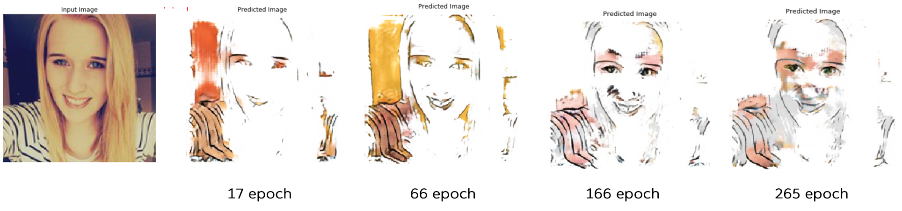

# selfie2webtoon(u-gat-it)

The purpose of this project is to translate selfie data into webtoon data using U-GAT-IT (work in progress).  

The original code was wrriten by tensorflow 1.14 ver, but I changed it to tensorflow 2.0 ver.

Original paper : [U-GAT-IT: Unsupervised Generative Attentional Networks with Adaptive Layer-Instance Normalization for Image-to-Image Translation](https://arxiv.org/abs/1907.10830)

# Results (work in progress)

# Dataset
- selfie (U-GAT-IT)
- Cartoon Set ([XGAN](https://google.github.io/cartoonset/))
